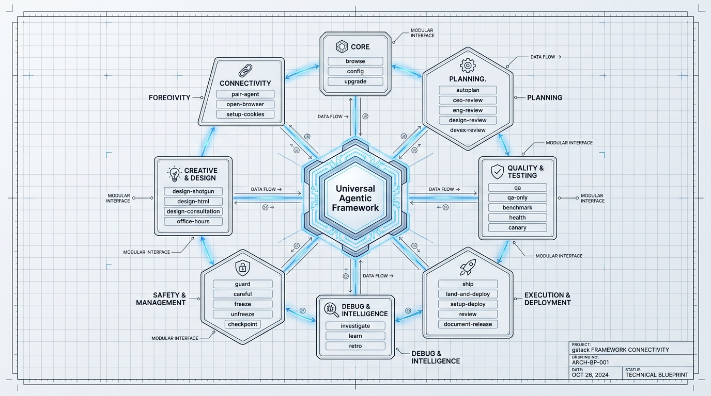
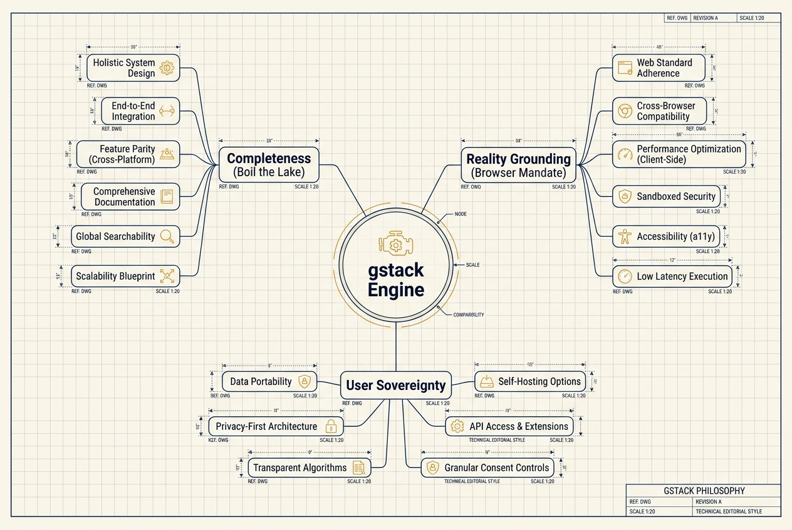

# gstack Windows 11 Native Port (ud-re-suite)

<p align="center">
  
</p>

<p align="left">
  <a href="https://github.com/thanh-abaii/gstack-windows-port/actions/workflows/ci.yml"></a>
  <a href="LICENSE"></a>
  
  
  
</p>

> [!CAUTION]
> **WINDOWS ONLY:** This suite is built with PowerShell and Python. It is **NOT** compatible with macOS or Linux.
> **CHỈ DÀNH CHO WINDOWS:** Bộ công cụ này được xây dựng bằng PowerShell và Python. **KHÔNG** tương thích với macOS hoặc Linux.

---

| [🇺🇸 English Version](#-english-version) | [🇻🇳 Phiên bản Tiếng Việt](#-tiếng-việt) |
| :--- | :--- |

---

<a name="-english-version"></a>

## 🇺🇸 English Version

### 🌟 Overview

`gstack-windows-port` is a Windows-native port of the gstack agent skill ecosystem. It replaces Unix-heavy shell assumptions with a Python/PowerShell bridge so agent workflows can run reliably on Windows 11 without WSL or Docker.

- **Original Creator:** [Garry Tan](https://github.com/garrytan)
- **Repo Source:** [github.com/garrytan/gstack](https://github.com/garrytan/gstack)
- **Port Version:** `v1.2.0` (May 2026 - Hardened Plus)
- **Primary Maintainer & Educational Hub:** Maintained by an administrator of the [Bình Dân Học AI Facebook Group](https://www.facebook.com/groups/binhdanhocai), used as a practical reference for Windows-native agent workflows in Vietnam's AI learning community.

### 🌍 Why Windows Native Agent Tooling Matters

Many coding agents generate Unix-style commands by default. On Windows this can cause parser failures, broken paths, unsafe file operations, and incomplete maintainer workflows. `gstack-windows-port` addresses this ecosystem gap by hardening 49 gstack skills for PowerShell-first execution, with tests, audit reports, and documentation for repeatable OSS maintenance.

### ✅ Current Proof Points

- **49 adapted gstack skills** hardened for Windows 11 execution.
- **PowerShell integration tests** in [`tests/`](tests/) for ported skill groups.
- **Static compatibility and secret-scan reports** in [`reports/`](reports/).
- **MIT licensed public repository** with a documented contribution workflow.
- **Codex-ready roadmap** for PR review, release checks, compatibility regression, and security hardening.

### 🚀 Technical Highlights (Port Features)

- **Hybrid Orchestration (IEX Pattern):** Uses `python | iex` to generate PowerShell-native runtime commands and avoid common shell parser failures.
- **Boil the Lake Philosophy:** Hardcoded completeness checks that encourage broader test coverage, reducing incomplete agent outputs.
- **Surgical Refactor v2.4:** All 49 skills have been stripped of Bashisms and "Hardened" with Python logic.
- **Reality Grounding:** Browser verification using Gemini's native `browser_agent` integration.

### 📚 Research & Documentation

Deep-dive into the port's anatomy:

- [Strategic Synthesis (McKinsey Style)](docs/strategic-synthesis-gstack-v2.md)
- [Technical Deep-Dive & System Intent](docs/system-intent.md)
- [Artifact Taxonomy & Safety Gates](docs/repo-artifact-taxonomy.md)
- [Full Skill Network Graph](assets/diagrams/gstack_skill_network_graph.jpg)
- [v1.2.0 Automated Windows Compatibility & Secrets Audit Report](reports/maintainer_audit_report_v1.2.0.md)
- [gstack Maintainer Auditor Skill Instruction Core](skills/gstack-maintainer-auditor/SKILL.md)

#### 📊 Visual System Architecture & Pipelines

Here are the visual representations of gstack's Windows native hybrid architecture and pipelines:



*Figure 1: gstack Windows Native Hybrid Orchestration Flow.*


*Figure 2: Unix-to-Windows Surgical Refactor Pipeline.*



*Figure 3: Hardened Control Gates & Security Logic.*

### 🛠️ Active Skills Directory (49 Hardened Skills)

To ensure maximum transparency, here is the complete directory of the **49 active skills** fully ported and covered by current static checks on Windows 11:

| Category | Skills | Description |
| :--- | :--- | :--- |
| **Core Dev & Automation** | `scrape`, `skillify`, `spec`, `document-generate`, `make-pdf`, `document-release` | Web scraping, automated skill creation, spec writing, post-ship documentation release, and PDF reporting pipelines. |
| **Context & State** | `context-save`, `context-restore`, `freeze`, `unfreeze` | Agent state capture, workspace freeze boundary logic, and session state recovery. |
| **Infra & Knowledge** | `setup-gbrain`, `sync-gbrain`, `codex`, `benchmark-models`, `landing-report`, `upgrade` | Global database setup, benchmark analysis, release report generation, and updates. |
| **UI/UX & Design** | `design-consultation`, `design-html`, `design-review`, `design-shotgun`, `devex-review` | Beautiful UI design auditing, HTML/CSS generation pipelines, and dev experience reviews. |
| **QA & Diagnostics** | `qa`, `qa-only`, `canary`, `health`, `checkpoint`, `investigate`, `office-hours`, `retro` | Test harnesses, canary deployments, system diagnostics, and retro reviews. |
| **Git & PR Workflows** | `ship`, `land-and-deploy`, `setup-deploy`, `setup-browser-cookies`, `open-gstack-browser` | Safe commit packaging, interactive PR land-and-verify loops, and secure browser setups. |
| **System Security** | `maintainer-auditor` | Static analysis pipeline to eliminate Unix Bashisms and secure code secrets. |
| **Core Orchestration** | `autoplan`, `benchmark`, `browse`, `careful`, `cso`, `guard`, `learn`, `pair-agent`, `plan-ceo-review`, `plan-design-review`, `plan-devex-review`, `plan-eng-review`, `plan-tune`, `review` | Master agent planning, safety guardrails, peer review loops, and autonomous strategy. |

### 🛡️ Compliance & Security Auditing

To guarantee reliability and secure execution under Windows 11, this repository utilizes an automated static audit pipeline powered by the **`gs:maintainer-auditor`** skill. All generated compliance records are stored transparently in the [/reports](reports/) directory.

Key audit checkpoints include:

- **Bashism Detection:** Scans all python/powershell scripts to eliminate incompatible Unix operators and shell commands.
- **Path Verification:** Hardens file actions against absolute Unix paths, ensuring proper Windows filesystem syntax.
- **Secret Scanning & Unsafe Automation Review:** Scans codebase recursively for hardcoded secrets, passwords, API keys, and risky automation patterns.
- **Line Ending Standards:** Verifies CRLF integrity across all PowerShell scripts.

### 🛠 Installation

Prerequisites:

- Windows 11
- PowerShell 7+
- Python 3.8+

```powershell
.\setup.ps1
```

### 🗺️ Roadmap 2026

- **Q2 2026 (Enhance Core):** Add more hardened PowerShell-native system diagnostics tools; achieve broader test coverage for path resolution across multiple Windows drives.
- **Q3 2026 (Codex Integration):** Build native Codex-assisted PR review & release checklist pipelines optimized specifically for Windows maintainer environments.
- **Q4 2026 (Telemetry & Auditing):** Implement local telemetry dashboards to track agent tool-calling performance and API token spend directly on Windows.

### 📜 Changelog

- **v1.2.0 (2026-05-31):** Hardened Plus release. Ported 12 new high-value/infrastructure skills (`scrape`, `skillify`, `spec`, `make-pdf`, `document-generate`, etc.), added the automated `gstack-maintainer-auditor` skill for Windows compatibility auditing, integrated visual architecture flowcharts, and set up PowerShell integration tests.
- **v1.0.0 (2026-04-19):** Official stable release. Completed Phase 4 of UD-Re-Suite.
- **v0.9.x (2026-04-14):** Initial compliance audit and Bash-to-Python bridge prototyping.

---

<a name="-tiếng-việt"></a>

## 🇻🇳 Tiếng Việt

### 🌟 Tổng quan

`gstack-windows-port` là bản port Windows-native của hệ sinh thái kỹ năng agent gstack. Dự án thay thế các giả định shell kiểu Unix bằng cầu nối Python/PowerShell để workflow agent chạy ổn định trên Windows 11 mà không cần WSL hoặc Docker.

- **Tác giả gốc:** [Garry Tan](https://github.com/garrytan)
- **Kho lưu trữ gốc:** [github.com/garrytan/gstack](https://github.com/garrytan/gstack)
- **Phiên bản Port:** `v1.2.0` (Tháng 5, 2026 - Hardened Plus)
- **Nhà duy trì & Định hướng Giáo dục:** Được bảo trì bởi quản trị viên của [Cộng đồng Facebook Bình Dân Học AI](https://www.facebook.com/groups/binhdanhocai), làm tài liệu tham khảo thực tế cho các luồng vận hành tác nhân AI trên Windows tại cộng đồng học AI Việt Nam.

### 🌍 Tại sao Công cụ Agent Nguyên bản Windows lại quan trọng

Nhiều tác nhân lập trình AI mặc định sinh lệnh kiểu Unix. Trên Windows, điều này có thể gây lỗi parser, sai đường dẫn, thao tác file thiếu an toàn và workflow bảo trì không hoàn tất. `gstack-windows-port` xử lý khoảng trống này bằng cách harden 49 kỹ năng gstack cho môi trường PowerShell-first, kèm test, báo cáo audit và tài liệu để bảo trì OSS có thể lặp lại.

### ✅ Bằng chứng hiện tại

- **49 kỹ năng gstack đã thích ứng** cho môi trường Windows 11.
- **PowerShell integration tests** trong [`tests/`](tests/) cho các nhóm kỹ năng đã port.
- **Báo cáo tương thích tĩnh và secret scan** trong [`reports/`](reports/).
- **Repository public, giấy phép MIT** và có quy trình đóng góp rõ ràng.
- **Roadmap sẵn sàng cho Codex**: PR review, release checks, compatibility regression và security hardening.

### 🚀 Đặc sắc kỹ thuật (Tính năng bản Port)

- **Hybrid Orchestration (IEX Pattern):** Sử dụng `python | iex` để sinh lệnh runtime PowerShell-native và tránh các lỗi parser phổ biến.
- **Triết lý Boil the Lake:** Các ràng buộc kiểm tra tính hoàn thiện giúp khuyến khích độ phủ kiểm thử rộng hơn, giảm thiểu các kết quả chưa hoàn tất của tác nhân AI.
- **Surgical Refactor v2.4:** Toàn bộ 49 kỹ năng đã được loại bỏ Bashisms và "Hardened" bằng logic Python.
- **Thực chứng (Reality Grounding):** Xác thực qua Trình duyệt nhờ tích hợp trực tiếp với `browser_agent` của Gemini.

### 📚 Tài liệu Nghiên cứu

Đi sâu vào giải phẫu bản port:

- [Báo cáo Chiến lược (Phong cách McKinsey)](docs/strategic-synthesis-gstack-v2.md)
- [Phân tích Kỹ thuật & Ý đồ Hệ thống](docs/system-intent.md)
- [Phân loại Artifact & Cổng Kiểm soát](docs/repo-artifact-taxonomy.md)
- [Sơ đồ Mạng lưới Kỹ năng (Mindmap)](assets/diagrams/gstack_skill_network_graph.jpg)
- [Báo cáo Kiểm toán Tương thích Windows & Secrets v1.2.0 Tự động](reports/maintainer_audit_report_v1.2.0.md)
- [Tài liệu Hướng dẫn Skill Kiểm toán Maintainer gstack](skills/gstack-maintainer-auditor/SKILL.md)

#### 📊 Sơ đồ Kiến trúc & Vận hành Hệ thống

Dưới đây là các hình ảnh trực quan mô tả kiến trúc lai (hybrid native) và quy trình vận hành của gstack trên Windows 11:


*Hình 1: Luồng xử lý điều phối lai (Hybrid Orchestration Flow) trên Windows.*


*Hình 2: Quy trình phẫu thuật tái cấu trúc mã nguồn (Surgical Refactor Pipeline) từ Unix sang Windows.*


*Hình 3: Logic kiểm soát cổng bảo mật (Feature Gate Logic) và an toàn hệ thống.*

### 🛠️ Danh mục Kỹ năng Hoạt động (49 Kỹ năng Hardened)

Để đảm bảo tính minh bạch tối đa, dưới đây là danh sách đầy đủ **49 kỹ năng** đã được port và được bảo vệ bởi các kịch bản kiểm toán tương thích tĩnh trên Windows 11:

| Phân nhóm | Danh sách Kỹ năng | Vai trò / Chức năng |
| :--- | :--- | :--- |
| **Phát triển Cốt lõi & Cào dữ liệu** | `scrape`, `skillify`, `spec`, `document-generate`, `make-pdf`, `document-release` | Cào dữ liệu web, tự động tạo kỹ năng mới, viết đặc tả, tự động phát hành tài liệu sau ship, và xuất báo cáo PDF tự động. |
| **Quản lý Context & Trạng thái** | `context-save`, `context-restore`, `freeze`, `unfreeze` | Lưu trữ trạng thái agent, thiết lập ranh giới đóng băng workspace, phục hồi phiên làm việc. |
| **Hạ tầng & Đồng bộ tri thức** | `setup-gbrain`, `sync-gbrain`, `codex`, `benchmark-models`, `landing-report`, `upgrade` | Thiết lập cơ sở dữ liệu toàn cục, phân tích benchmark, xuất báo cáo landing, cập nhật gstack. |
| **Thiết kế UI/UX & Đánh giá** | `design-consultation`, `design-html`, `design-review`, `design-shotgun`, `devex-review` | Kiểm toán UI/UX cao cấp, tạo mã HTML/CSS tự động, đánh giá trải nghiệm nhà phát triển. |
| **QA & Chẩn đoán hệ thống** | `qa`, `qa-only`, `canary`, `health`, `checkpoint`, `investigate`, `office-hours`, `retro` | Khung kiểm thử tự động, triển khai canary, kiểm tra sức khỏe hệ thống và họp rút kinh nghiệm. |
| **Quy trình Git & Pull Request** | `ship`, `land-and-deploy`, `setup-deploy`, `setup-browser-cookies`, `open-gstack-browser` | Đóng gói commit an toàn, tự động merge & xác thực PR trên production, cấu hình cookie trình duyệt. |
| **Bảo mật & Kiểm toán Hệ thống** | `maintainer-auditor` | Tự động quét kiểm toán tĩnh loại bỏ Bashisms và bảo mật mã nguồn khỏi rò rỉ secret keys. |
| **Điều phối Cốt lõi** | `autoplan`, `benchmark`, `browse`, `careful`, `cso`, `guard`, `learn`, `pair-agent`, `plan-ceo-review`, `plan-design-review`, `plan-devex-review`, `plan-eng-review`, `plan-tune`, `review` | Điều phối lập kế hoạch lớn, thiết lập cổng bảo vệ, cơ chế review chéo và tự động hóa học tập. |

### 🛡️ Kiểm toán & An toàn Hệ thống

Để đảm bảo tính vận hành an toàn tối đa trên Windows 11, repository này tích hợp một quy trình kiểm toán tĩnh tự động được điều phối bởi Skill **`gs:maintainer-auditor`**. Tất cả báo cáo kiểm toán được lưu trữ minh bạch tại thư mục [/reports](reports/).

Các hạng mục kiểm duyệt chính bao gồm:

- **Phát hiện Bashisms:** Quét toàn bộ mã nguồn để loại bỏ các cú pháp Unix bất tương thích trên Windows.
- **Kiểm tra Đường dẫn:** Đảm bảo toàn bộ thao tác tệp tin sử dụng cú pháp thư mục chuẩn PowerShell/Windows.
- **Quét secret và rà soát automation rủi ro:** Quét đệ quy để phát hiện hardcoded secrets, mật khẩu, API keys và các mẫu tự động hóa thiếu an toàn.
- **Định dạng xuống dòng:** Xác thực chuẩn CRLF trên toàn bộ các tệp kịch bản PowerShell.

### 🛠 Cài đặt

Yêu cầu:

- Windows 11
- PowerShell 7+
- Python 3.8+

```powershell
.\setup.ps1
```

### 🗺️ Lộ trình Phát triển 2026 (Roadmap)

- **Quý 2/2026 (Củng cố Cốt lõi):** Bổ sung thêm các công cụ chẩn đoán hệ thống thuần PowerShell; hướng tới mở rộng độ phủ kiểm thử việc phân tích đường dẫn trên các ổ đĩa Windows.
- **Quý 3/2026 (Tích hợp Codex):** Xây dựng các luồng PR review và release checklist tự động qua Codex, được tối ưu riêng cho môi trường bảo trì trên Windows.
- **Quý 4/2026 (Giám sát & Đo lường):** Triển khai bảng điều khiển giám sát cục bộ (local telemetry) để theo dõi hiệu năng gọi tool của agent và chi phí API token trực tiếp trên Windows.

### 📜 Nhật ký thay đổi (Changelog)

- **v1.2.0 (2026-05-31):** Bản phát hành Hardened Plus. Port hàng loạt 12 kỹ năng mới (`scrape`, `skillify`, `spec`, `make-pdf`...), triển khai Skill kiểm toán tự động `gstack-maintainer-auditor` phát hiện Bashisms & API secrets, tích hợp các sơ đồ trực quan và cài đặt hệ thống kịch bản kiểm thử PowerShell.
- **v1.0.0 (2026-04-19):** Phát hành bản ổn định chính thức. Hoàn tất Giai đoạn 4 của UD-Re-Suite.
- **v0.9.x (2026-04-14):** Kiểm toán tuân thủ ban đầu và thử nghiệm Bridge Bash-to-Python.

---

*Developed & Refined by Uncle Dao Reverse Engineering Suite - 2026*
